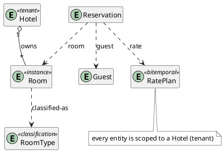

# `meta/examples` — the modeling cookbook

The **on-ramp** for designers. Each example is a small, **runnable, `make`-verified**
Alloy file that demonstrates *one* modeling pattern in the smallest form, with a fixed
recipe header. Come here to learn a pattern, copy a correct starting point, or refresh
how a tricky concept (state machines, parallel regions, bitemporality) is expressed.

Why runnable: prose rots, a green `check` cannot. The examples are simultaneously a
tutorial **and** a regression suite for the idioms. Run them with `make check-examples`.

## The shared domain — a Hotel property-management system

To avoid term-bleed with the manufacturing domain, **every example uses one neutral
cast** (learn it once):

| Term | Role | Illustrates |
|---|---|---|
| **Hotel** | the tenant boundary (one property in a multi-property PMS) | tenant / scope |
| **RoomType** | an **extensible classification** — Suite, King, Double Queen, Single, Beach View, Patio View, … (reference data; grows as *atoms*, not code) | type side of type/instance |
| **Room** | a physical room ("101"), classified by a RoomType | instance side; parallel-region state |
| **Reservation** | a booking: guest + dates + rate | aggregate root; lifecycle |
| **Guest** | the person booking | soft-reference target |
| **RatePlan** | nightly pricing, effective over date ranges | bitemporal |
| **Money / DateRange** | rate, stay window | value objects (no identity) |

`RoomType` (type) vs `Room` (instance) is the neutral stand-in for the live model's
`Item` vs `InventoryItem`; the Room's three orthogonal state regions stand in for X.731.

The cast and its relationships (preview with the VS Code PlantUML plugin):



## Catalog (the tour, in reading order)

| # | Pattern | Status | UML / FP analogue |
|---|---|---|---|
| 01 | Identity & the `Entity` bound | planned | UML class; identity |
| 02 | Tenant scoping + soft refs + `resolve` | **ready** | association by FK; partition |
| 03 | Aggregation (parent→child) | planned | composition/aggregation |
| 04 | Type / instance (extensible classification) | **ready** | «type»/«instance»; powertype |
| 05 | Value objects | planned | value type / no identity |
| 06 | Subtype vs. generics | planned | generalization; bounded generics |
| 07 | Enumerations (closed set) | planned | enumeration |
| 08 | State machine (reified) | planned | UML state machine |
| 09 | Parallel / orthogonal regions | **ready** | AND-states; the X.731 twin |
| 10 | Tight by default (no-orphan, forcing function) | planned | (no clean UML analogue) |
| 11 | Change & the frame problem | **see 16** (the `var` half shows held-state + frame obligations) | operation; FP `old→new` |
| 12 | Bitemporality (versions as data) | deferred (DT-001.03) | temporal/historized data |
| 13 | Keyed value algebra (MultiMoney / MultiQuantity) | **ready** | free module; finitely-supported map |
| 14 | Event-sourced LEVEL signal from a reified op-log (DT-006 spike → DT-008) | **ready** | event store + derived projection; fold/prefix-sum |
| 15 | Guarded action chain + state-as-projection (meta/action, DT-006) | **ready** | command + guard [precondition]; foldl over a filtered log |
| 16 | Two time models — `var`/LTL trace vs reified log + projection, with the AGREEMENT theorem (replay ≡ fold) | **ready** | state machine vs event store; State monad run ≡ foldl |

"Ready" = a runnable file exists. "Planned" = a catalog slot to fill as the pattern is
needed. "Deferred" = waits on a modeling decision not yet made (the behavioral/temporal
layer, DT-001.03) — we do not pre-decide it here.

## Techniques cross-index

The catalog above indexes by *pattern* (what you want to model); this table indexes by *technique*
(the Alloy craft you want to see demonstrated). An example may appear under several techniques.

| Technique | Examples |
|---|---|
| Premise / fact / **witness** triad (unprovable axioms as `pred`s; SAT witnesses guard vacuity) | 13, 14 (`calendarAxioms`) |
| Guard-rejection / impossibility idiom (`run <bad> … expect 0`) | 02, 04, 09, 13, 15, 16 |
| Tenant scoping, soft refs, `resolve`, dangling-allowed | 02 |
| Type / instance via classification atoms | 04 |
| Reified state machines + **exact scopes** for `one sig` families | 09 |
| Keyed value algebra (normal-form maps, widen/collapse) | 13 |
| **State-as-projection** (no `World`, no domain `var`; state = fold over the log) | 14, 15, 16 |
| **Witnessing pattern** (stored verdict ⟺ evaluable guard predicate) | 15 |
| **Agreement theorem** (two independent encodings proven equal) | 14 (LOCF ≡ cumulative), 16 (replay ≡ fold) |
| Model time as data (`Tick` order over reified events) vs `var`/LTL traces | 15, 16 (14 orders by `Instant` — deliberate, see its header) |
| `var`/LTL mechanics: primed transitions, frame obligations, `always` discipline (§3.2) | 16 |

See also: [rosetta-uml.md](rosetta-uml.md) (the full UML/FP ↔ Alloy translation table)
and the workbook `modeling-conventions.md` (the *why* behind each convention).

## Conventions

- **One pattern per file**, named `exNN_pattern_name.als` (`module meta/examples/exNN_pattern_name`). The `ex` prefix is required — Alloy module path components cannot start with a digit.
- **Self-contained**: an example opens `meta/*` machinery but defines its own toy Hotel
  sigs — it never depends on a domain module (`reference_data`, `resources`), so it stays
  minimal and fast.
- **Fixed recipe header** (copy [`ex00_template.als`](ex00_template.als)): Pattern / UML /
  FP / Use-when / Avoid / See-also.
- **Every file is a root** carrying `run`/`check` — never `open`ed by other code.
- **Diagrams welcome.** Where a picture clarifies, embed a PlantUML diagram — in a
  fenced ` ```plantuml ` block in markdown, or inside a `/* … */` block comment in an
  `.als` file (preview with the VS Code PlantUML plugin). In `.als` comments, do **not**
  prefix the diagram lines with `*` — a leading `*` corrupts the PlantUML the plugin
  extracts; keep the `@startuml…@enduml` lines flush. Validate via the PlantUML MCP tool
  before committing (workspace convention).
- **Express invariants/constraints OCL-style: `//{ expr }//`** — braces (the UML
  constraint notation) in creole italic, attached to the constrained element(s).
  **Stay dependency-free:** do NOT use `<latex>`/`<math>` — math-to-SVG needs Apache
  Batik, which the stock local `plantuml.jar` lacks (it fails in the VS Code preview).
  Plain creole (`//italic//`, `<b></b>`, `{ }`) renders everywhere with no extra setup.
- **Render entity sigs as `entity`** (not `class`) to align with the kernel's `Entity`
  bound, and give notes a **`#white`** background (`note as N #white` / `note … #white :`)
  so they stay unobtrusive against the diagram.
- **Definition of done for new `meta` machinery: it ships with an example here.** That
  rule keeps the cookbook from going stale — framework and tutorial move together.
- **Rationale that outgrows a recipe header goes to the workbook's `modeling/` notes — never to
  `design/`.** The example stays a runnable recipe with its header; deep why/trade-off prose becomes a
  methodology note cross-linked both ways (e.g. ex16 ↔ `modeling/two-time-models.md`; the scalar
  examples ↔ `modeling/scalar-arithmetic.md`). `design/` documents the system's model, not the
  cookbook — and prose mirrors of examples are the drift surface this cookbook exists to avoid.

## Running

```bash
make check-examples                 # run every example (verified idioms)
java -jar tools/alloy.jar exec -c "*" -o /tmp/ao -f alloy/meta/examples/ex02_scoping_and_soft_refs.als
```
